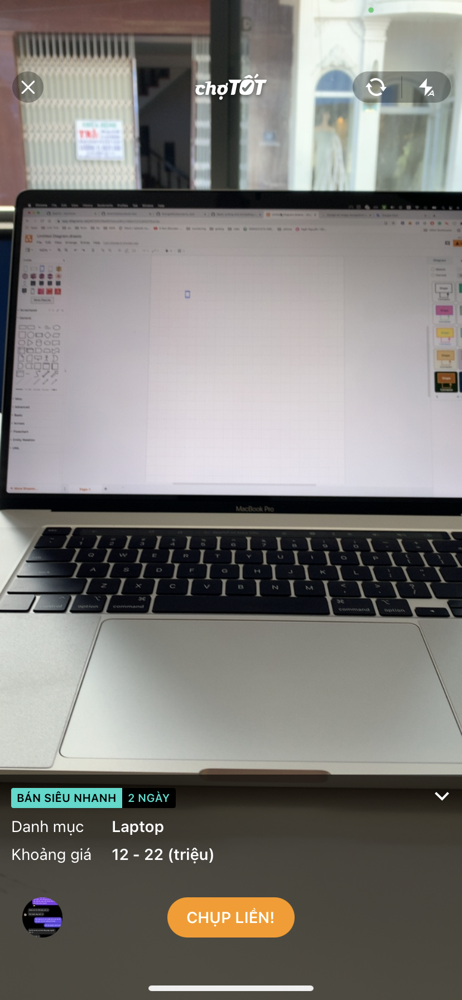
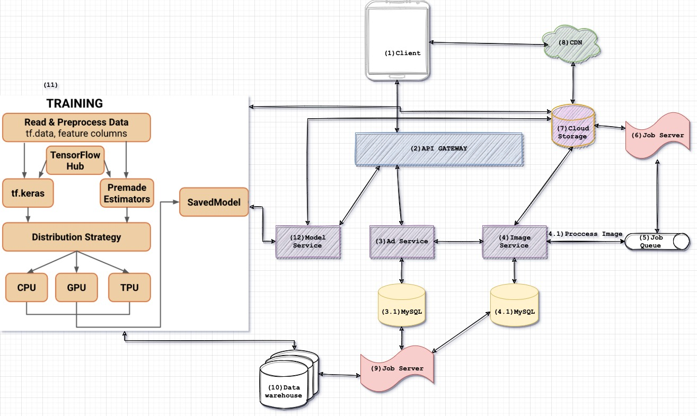

Đây là một trong những ứng dụng thực tế mà tôi và team của tôi đã làm và đã golive.

Một vài hình ảnh thực tế:

- 
- 
- 

# Bài toán
- Xây dựng ứng dụng giúp user đăng bán đồ cũ 1 cách nhanh chóng, có thể định giá được sản phẩm và loại sản phẩm.
# Kiến trúc

- (1) Client có mốt đồ muốn đăng bán trên mobile app
- (2) Để app có thể giao tiếp với hệ thống, cần phải có 1 đầu giao tiếp với service bên trong gọi là api gateway, cụ thể là kong gateway
- (3), (4), (12) có những microservice, xử lý từng business logic riêng và mỗi service có thể sử dùng database hoặc ngôn ngữ riêng
- 